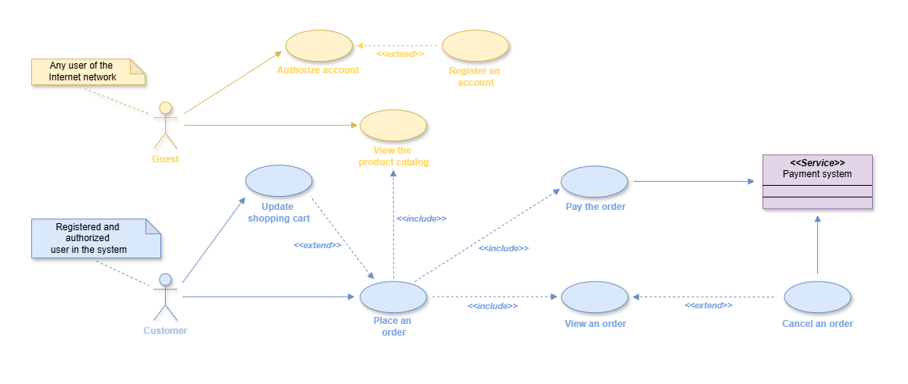
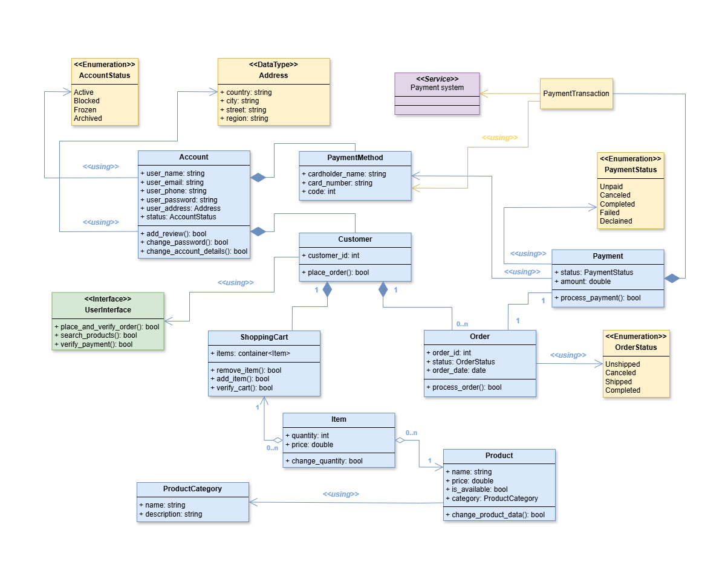
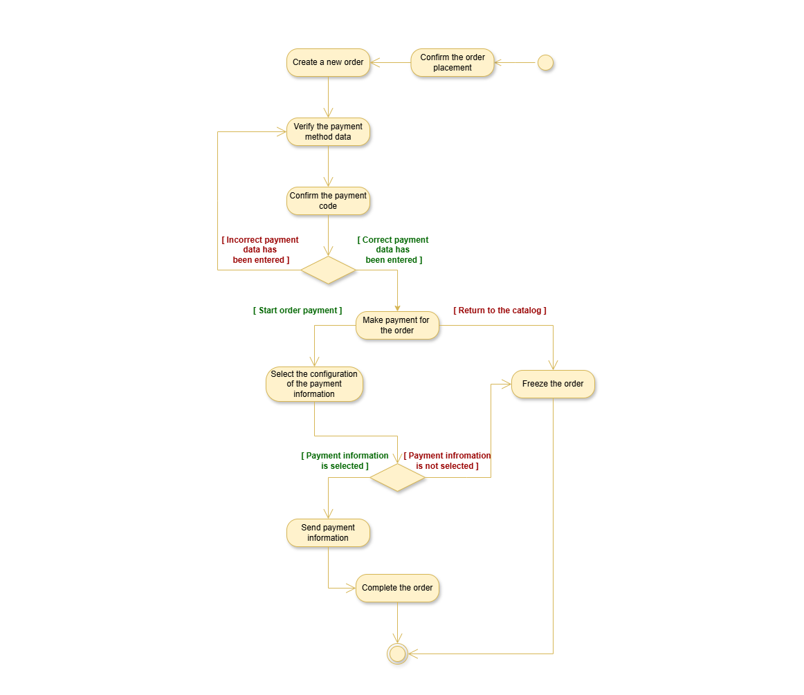
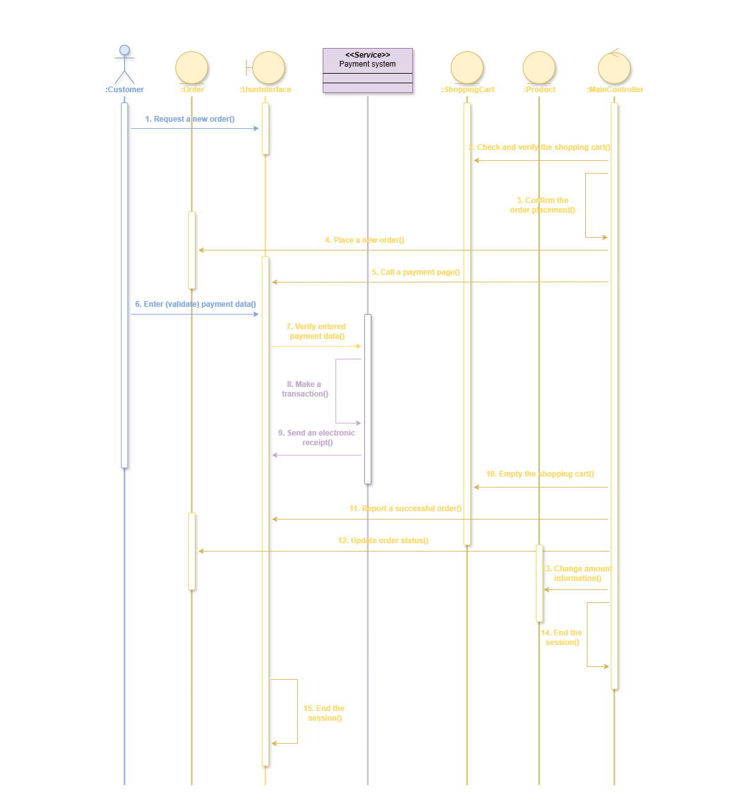
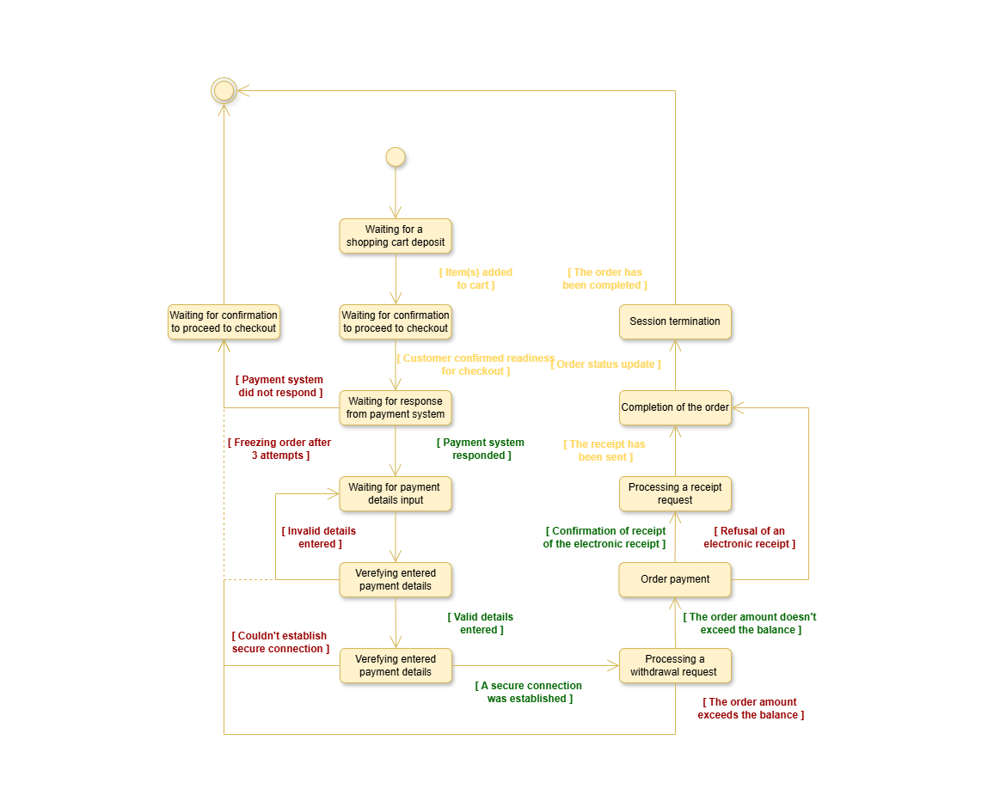
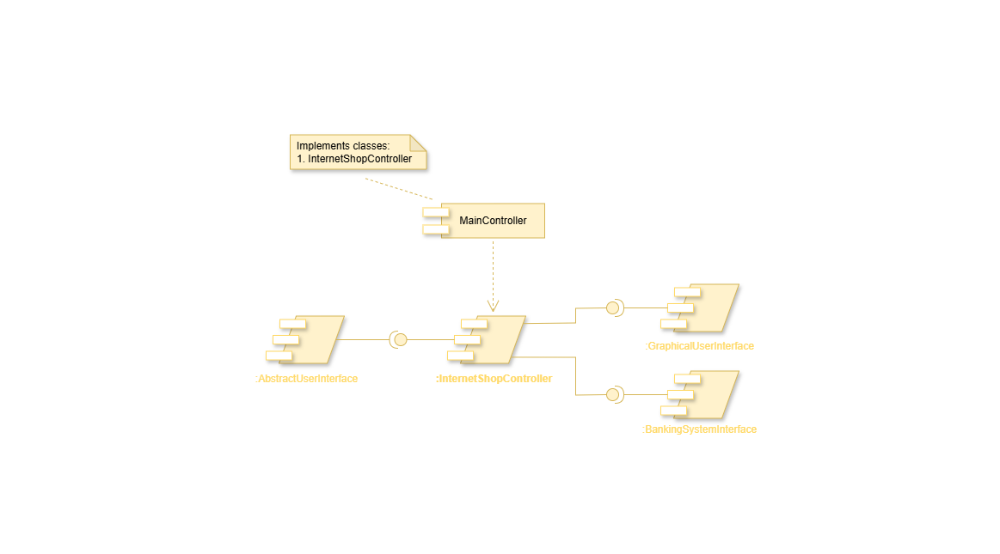

# Концептуальное моделирование интернет магазина

Проект представляет собой концептуальное описание модели-прототипа интернет-магазина средствами UML. Его цель - зафиксировать ключевые компоненты и процессы системы на уровне бизнес-логики, обеспечивая единое понимание предметной области. Как артефакт системного анализа, модель демонстрирует декомпозицию системы: от выявления акторов и ценариев использования до детализации бизнес-процессов и жизненных циклов сущностей. 

  

## Навигация 
1. [Описание проекта](#навигация)
2. [Описание модели](#установка)

## Описание модели 

Модель построена в соответствии с принципами объектно-ориентированного анализа и реализует классический подход к декомпозиции сложной системы. Ниже представлены разработанные диаграммы, каждая из которых отвечает на типичные вопросы, которые могли бы возникнуть при описании такой системы.

### 1. Диаграмма вариантов использования

Диаграмма вариантов использования определяет границы системы глазами пользователя. Выделяет основных акторов и ключевые сценарии их взаимодействия с магазином.

  

  Рисунок 1. Диаграмма вариантов использования

### 2. Диаграмма классов

Диаграмма классов представляет собой статическую структуру ключевых сущностей предметной области. Выделяет основные классы, их атрибуты, методы и связи между ними.

  

  Рисунок 2. Диаграмма классов

### 3. Диаграмма активности

Диаграмма активности представляет собой визуализацию бизнес-процесса "Оформление заказа" в виде пошагового алгоритма. Описывает последовательность действий, точки принятий решений и ветвления.

  

  Рисунок 3. Диаграмма активности

### 4. Диаграмма последовательности

Диаграмма последовательности описывает процесс "Оформление заказа" через ключевых сущностей и их взаимодействие. Показывает жизненные линии ключевых сущностей, последовательность их взаимодействий и временную привязку этих взаимодействий. 

  

  Рисунок 4. Диаграмма последовательности

### 5. Диаграмма состояний

Диаграмма состояний описывает модель жизненного цикла бизнес-процесса "Оформление заказа" от возникновения до завершения. Отражает возможные состояния и события, которые вызывают переход между ними.  

  

  Рисунок 5. Диаграмма состояний

### 6. Диаграмма компонентов

Диаграмма компонентов представляет собой упрощенный архитектурный взгляд на физические компоненты системы. Показывает основные модули и как они связаны. 

  

  Рисунок 6. Диаграмма компонентов

